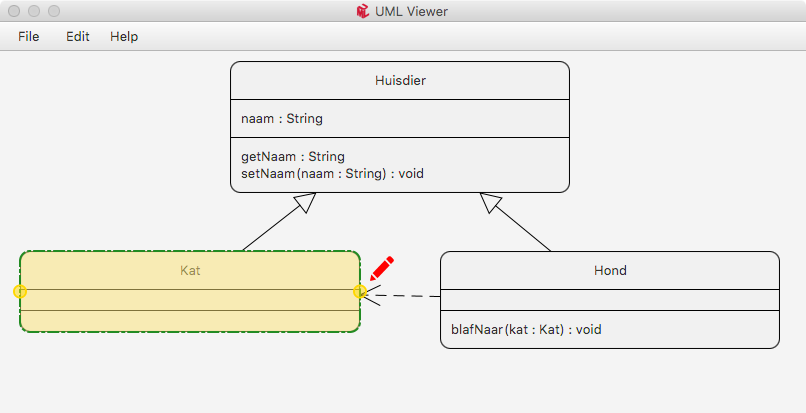
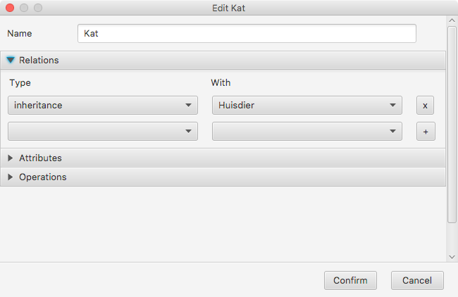

# UML Editor
Project for the course Object Oriented Programming (C003772). Made during my first year of Bachelor of Science in Computer Science at Ghent University.

## Startup arguments
`java -jar 'jar-file' [xml_file] [screenshout output]`

- When the program is started without arguments, a blank worksheet is opened
- When the program is started with one argument, the given file is opened
- When the program is started with two arguments, a screenshot of the given xml file is made at the given output location

## Screenshots

## Dependencies
- Java 8
- JavaFX
